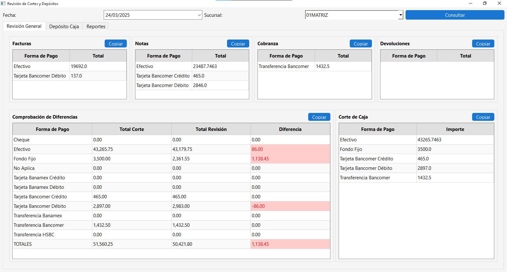

# Revisión de Cortes y Depósitos

Aplicación de escritorio desarrollada con **Python + PyQt6** para la visualización, validación y reporte de cortes de caja diarios por sucursal.

---

## Características principales

- Consulta por fecha y sucursal.
- Visualización separada de:
  - Facturas
  - Notas
  - Cobranza
  - Devoluciones
  - Cortes de Caja
  - Depósitos
- Comprobación de diferencias automáticas.
- Generación de reporte Excel.
- Interfaz responsiva, ordenada y profesional.

---

## Captura de pantalla

> _Puedes subir una imagen en la carpeta `resources/` y hacer referencia así:_



---

## Instalación

1. Clona el repositorio:

```bash
git clone https://github.com/tu-usuario/proyecto-revision-cortes.git
cd proyecto-revision-cortes


Crea un entorno virtual e instala las dependencias: 
python -m venv venv
venv\\Scripts\\activate  # Windows
pip install -r requirements.txt

Crea un archivo .env con tus credenciales de SQL Server: 
SQL_SERVER=mi_servidor_sql
SQL_PORT=1234
SQL_DATABASE=DataBases
SQL_USER=user
SQL_PASSWORD=*********

Ejecuta el proyecto: 
python main.py


Estructura del proyecto
ProyectoRevisionCortes/
│
├── main.py
├── ui/
│   ├── main_window.py
│   ├── revision_general_tab.py
│   └── components.py
├── services/
│   └── consulta_service.py
├── db/
│   └── conexion.py
├── reports/
│   └── exportador_excel.py
├── resources/
│   ├── estilos.qss
│   └── captura_principal.png
├── .env
└── README.md


✅ Cómo instalar desde cero
Quien clone el repo podrá hacer:
pip install -r requirements.txt

Y tendrá TODO funcionando.
